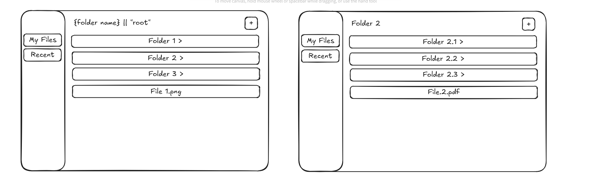

# Next.js File Explorer Interview Task

This repository contains a partially implemented file explorer built with **Next.js (App Router)**, **TypeScript**, and **Tailwind CSS**. Data is stored in memory on the server.

## Existing Features

* Basic layout with a sidebar and main area.
* API endpoints to create folders and files.
* An in-memory data structure representing a folder tree.

## Candidate Tasks

1. Enable users to create files inside folders. This requires:

   * Using the `/api/files/[id]` endpoint to add new files.
   * Adding UI controls for file creation.

2. Display different file types (e.g., `.png`, `.mp4`, `.pdf`).

3. Implement a "step back" mechanism to navigate to the parent folder (not the browser’s back button). If a user opens a folder, they should be able to return to its parent.

4. Fix the bug where creating a folder inside a subfolder mistakenly creates it in the parent folder.

5. Refactor the existing codebase to improve clarity, maintainability, and structure.

6. Enhance the design to make it look and feel more like a real application. This includes:

   * Responsive layout.
   * Optimized file viewing.

7. (Optional) Implement a **Recent Files** page.

8. (Optional) Add any other features you’d like!

## Deliverables

1. A short video recording (maximum 2 minutes) demonstrating the functionality, including:

   * Creating folders and files.
   * Viewing files.
   * Responsive design in action.

2. A link to a GitHub repository containing the source code.

## Design Reference

The diagram below illustrates the expected design:



## Getting Started

Install dependencies and run the development server:

```bash
npm install
npm run dev
```

The app uses an in-memory store, so all data will be reset when the server restarts.

---

✨ Good luck!